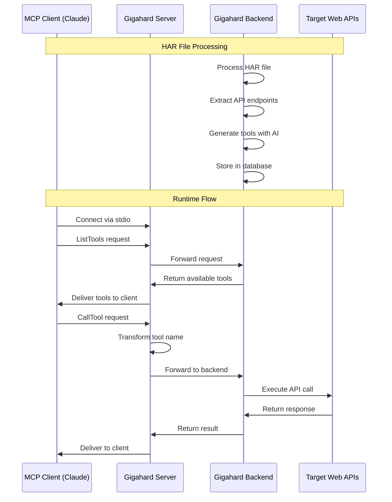

# Gigahard MCP Bootleg Market

Turn browser traffic into tool calls. Smuggle your network requests into an MCP.

## What's This All About?

Gigahard is where you come when you need to get your hands on some Model Context Protocols (MCPs). Our server connects AI assistants like Claude with web APIs extracted from your HAR files. Think of it as a way to "borrow" functionality from websites and turn it into something AI can use.

## How It Works



## Installation

```bash
# Install the package
npm install -g @lekt9/gigahard-mcp

# Set up your credentials
export GIGAHARD_API_KEY=your_api_key

# Run the server
gigahard-mcp
```

## Creating MCPs

To create your own Model Context Protocols from HAR files:

1. Visit [https://www.gigahard.org](https://www.gigahard.org)
2. Upload your HAR file
3. The platform will process the file and generate the necessary tools
4. Obtain your API key from the website

### The Underground MCP Market

#### Premium Agent Tools

MCPs are the secret sauce that AI agents crave. These Model Context Protocols are powerful tools that agents use to interact with external services and fetch real-time data. Without them, AI is trapped in its own bubble.

#### APIs in Designer Clothes

Let's be real - MCPs are just APIs with fancy clothes on. They follow OpenAPI specs like any other API, but they're packaged nicely for AI consumption. It's the same product, different wrapping - pure marketing genius.

#### Reverse Engineering the Good Stuff

Every website out there is constantly sending network requests. With the right tools, you can capture these requests, reverse engineer them, and create your own bootleg copy of their API. It's like photocopying someone else's premium content.

#### From Traffic to Premium MCP

Our system takes your ordinary HAR files and transforms them into high-quality MCPs that any AI agent would pay top dollar for. We analyze the endpoints, parameters, and responses to create a perfect replica that tools can consume.

> **Tip**: When an AI agent uses a tool, it's making an API call through an MCP. By creating these protocols, you can extend AI capabilities to interact with virtually any digital service.

### Smuggling Guide

A HAR (HTTP Archive) file captures all the network requests your browser makes while interacting with a website. Follow these steps to create one:

#### Step 1: Open Developer Tools

Right-click anywhere on the webpage and select "Inspect" or "Inspect Element". Alternatively, use these keyboard shortcuts:

- Chrome/Edge/Firefox (Windows): F12 or Ctrl+Shift+I
- Chrome/Edge/Firefox (Mac): Option+Cmd+I
- Safari (Mac): Enable Develop menu first (Safari > Preferences > Advanced > Show Develop menu), then Option+Cmd+I

#### Step 2: Record Network Activity

In the Developer Tools panel, navigate to the "Network" tab.

- Ensure recording is active (usually a red circle icon).
- Check the "Preserve log" option to keep requests across page loads.
- Optional: Clear existing logs using the clear icon for a cleaner capture.
- Perform the actions on the website that trigger the API calls you want to capture (e.g., logging in, loading data, submitting a form).

Interact with the site thoroughly to ensure all desired requests are recorded.

#### Step 3: Export HAR File

Once you've captured the necessary activity, right-click anywhere in the list of network requests.

- Select "Save all as HAR with content" (or similar wording like "Export HAR...").
- Choose a location to save the `.har` file.

You can now upload this HAR file using the uploader on the Gigahard website.

> **Important**: HAR files can contain sensitive information like cookies, authentication tokens, and personal data. Handle them securely and avoid sharing them publicly.

## Usage with Claude

1. Install the Claude Desktop application
2. Open Claude settings and navigate to the MCP section
3. Add a new MCP server with this command:
   ```
   npx -y @smithery/cli@latest install @lekt9/gigahard-mcp --claude
   ```
4. Start a conversation with Claude and use the tools provided by your Gigahard MCP

## Environment Variables

- `GIGAHARD_API_KEY`: API key for authenticating with the Gigahard backend
- `NEXTJS_APP_URL`: URL of the Gigahard backend (defaults to https://gigahard.org/)

## Technical Details

### Architecture

The server follows a simple proxy architecture:

1. **MCP Protocol Handling**: Implements the MCP protocol for client communication
2. **Request Forwarding**: Forwards client requests to the Gigahard backend
3. **Response Transformation**: Transforms responses to match MCP protocol requirements

### Key Components

- **Server Class**: Main server implementation using the MCP SDK
- **Request Handlers**: Handlers for ListTools and CallTool requests
- **Name Transformation**: Functions to convert between naming conventions
- **Error Handling**: Proper error propagation and handling

## Development

To run the server in development mode:

```bash
# Clone the repository
git clone https://github.com/lekt9/gigahard-mcp.git
cd gigahard-mcp

# Install dependencies
npm install

# Build the server
npm run build
```

## Limitations

- The server requires a valid API key to make authenticated requests to the backend
- Tool execution depends on the availability of the Gigahard backend
- The server does not cache tool definitions or results

## License

MIT
